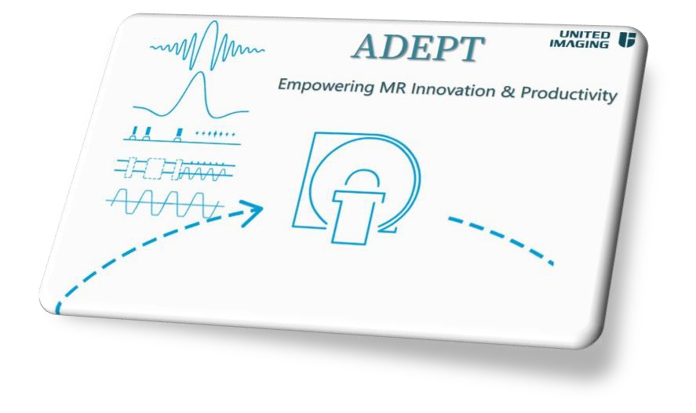

# Welcome to United Imaging MR ADEPT Forge! 👋

## 🚀 Introduction

**uMR ADEPT**(Application Development Environment and Programming Tools) platform is designed for effective MR sequence and reconstruction development. 
Sequence demo written using Pulseq and some other open-source tools coming from United Imaging MR team will be released here.

Website: https://adept-forge.github.io/

## 🌟 Features
- **Full Field Strength and System Support**: Covering United Imaging 1.5T, 3T systems, pioneering 5T platform, and 9.4T ultra-high field research instrument, enabling single development for multi-platform research applications.

- **Friendly Advanced Improvement**: Effecitive binary sequence file format design for complex sequence storage and execution, friendly to ultra-high resolution design. 

- **Complete Compatibility**: Fully compatible with the Pulseq open-source framework, ensuring your research sequences can run on United Imaging equipment with minimal modifications, truly realizing "write once, run anywhere".

- **Powerful Development Tools**: Providing professional tools for sequence waveform simulation, raw data acquisition, and more, helping researchers seamlessly integrate the entire workflow of development, testing, and analysis.

- **Comprehensive Documentation**: Pulseq user manual optimized for United Imaging MR system characteristics, including detailed examples and best practices, accelerating your research sequence development process.

- **Global Research Collaboration**: Professional global research collaboration team providing prompt response to researchers.

- **Open Ecosystem**: Join the global MR research community to jointly promote MRI technology innovation.

## 📄 Articles
- Liu Z, Aburas A, Wang Z, Zhang C, Zhu J, Zhou X. Open-source Pulseq Sequences with United Imaging MRI Systems. In: Proceedings of the Cape Town - 2026 ISMRM-ISMRT Annual Meeting and Exhibition, Cape Town, South Africa. Program #567-03-013. 
